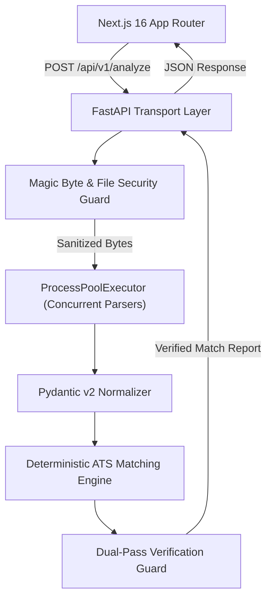

# Merit AI — Resume Analyzer

<p align="left">
  <a href="https://github.com/your-username/Resume_Analyzer/actions"></a>
  <a href="https://fastapi.tiangolo.com/"></a>
  <a href="https://nextjs.org/"></a>
  <a href="https://www.python.org/"></a>
  <a href="https://www.typescriptlang.org/"></a>
  <a href="./LICENSE"></a>
</p>

**Production-grade, full-stack ATS intelligence platform engineered with FastAPI Clean Architecture and Next.js 16.**

Merit AI performs deep structural analysis of resumes against target job descriptions, providing deterministic ATS scoring, verbatim evidence isolation, and evidence-grounded verification.

---

## 📸 Overview

<p align="center">
  
</p>

---

## 🎯 Why Merit?

- **The Problem**: Traditional Applicant Tracking Systems (ATS) use simplistic keyword matching that fails candidates who describe identical experience using different terminology. Conversely, naive LLM implementations suffer from hallucinations—inventing skills candidates never claimed.
- **The Solution**: Merit AI introduces an engine combining exact text extraction, lexical verification, deterministic weighted policies, and a **Dual-Pass Verification Guard** that validates every insight against verbatim raw document quotes.
- **Why This Project Exists**: Built to demonstrate enterprise-level software engineering—Clean Architecture, CPU thread pool offloading, strict input sanitization, automated Red Team testing, and production-grade UI design.

---

## ✨ Key Features

- **📄 Concurrent Document Parsing**: Multi-threaded text extraction supporting PDF (`pdfplumber`) and DOCX (`python-docx`).
- **🎯 Deterministic ATS Scoring**: 0–100 match score calculated via weighted policies across hard skills, experience relevancy, tooling, and education.
- **💬 Verbatim Evidence Extraction**: Matches skills directly to exact quote snippets extracted from the resume.
- **🛡️ Evidence-Grounded Extraction**: Two-pass LLM pipeline that drops unverified entities not present in raw document text.
- **⚡ Real-Time SaaS Interface**: Next.js 16 web app featuring Framer Motion micro-interactions and dark mode.
- **🔒 Enterprise Security**: Magic byte file validation, stream limits (<5MB), UUID filename sanitization, and DoS defenses.

---

## 📸 Screenshots

| View | Screenshot |
|---|---|
| **Landing Page** | `docs/screenshots/01_landing_page.png` |
| **Upload & Input Workspace** | `docs/screenshots/02_upload_workspace.png` |
| **Real-Time Processing** | `docs/screenshots/03_processing_skeleton.png` |
| **ATS Match Dashboard** | `docs/screenshots/04_results_dashboard.png` |
| **Verbatim Evidence Quotes** | `docs/screenshots/05_evidence_modal.png` |

---

## 🏛️ Architecture Overview



*For complete architectural specifications, sequence diagrams, and threat models, see [docs/Architecture.md](docs/Architecture.md).*

---

## 🛠️ Tech Stack

| Layer | Technology | Key Libraries / Modules |
|---|---|---|
| **Frontend** | Next.js 16 (App Router), TypeScript | Tailwind CSS v4, Framer Motion, Radix UI |
| **Backend** | Python 3.12+, FastAPI | Pydantic v2, Uvicorn, SQLAlchemy |
| **Document Parsers** | Multi-threaded Python ProcessPool | `pdfplumber`, `python-docx` |
| **AI / Semantic Engine** | Groq LLaMA 3.3 / Google Gemini 1.5 | Dual-Pass Verification Pipeline |
| **Security & Quality** | Pytest, Black, isort, mypy, flake8 | Magic byte inspector, Red Team test suite |
| **Infrastructure** | Docker, Docker Compose | Vercel (Frontend), Render (Backend) |

---

## 🚀 Quick Start

### 1. Clone Repository
```bash
git clone https://github.com/your-username/Resume_Analyzer.git
cd Resume_Analyzer
```

### 2. Run Backend
```bash
cd backend
python -m venv venv

# Windows (PowerShell)
.\venv\Scripts\Activate.ps1
# Linux/macOS
source venv/bin/activate

pip install -r requirements.txt
cp .env.example .env
uvicorn app.main:app --reload
```
*Backend API will run at `http://localhost:8000` (Swagger docs at `/docs`).*

### 3. Run Frontend
Open a new terminal:
```bash
cd frontend
npm install
npm run dev
```
*Frontend app will run at `http://localhost:3000`.*

---

## 📂 Project Structure

```text
Resume_Analyzer/
├── backend/                  # FastAPI REST API (Clean Architecture)
│   ├── app/
│   │   ├── api/v1/          # REST Endpoints
│   │   ├── core/            # Config, Security, Logging
│   │   ├── exceptions/      # Domain Exceptions & Exception Handlers
│   │   ├── parsers/         # Concurrent PDF & DOCX Extraction Engine
│   │   ├── matching/        # ATS Match Engine & Evidence Collector
│   │   └── validators/      # Magic Byte & File Security Guards
│   └── tests/               # Pytest Suite & Red Team Defenses
├── frontend/                 # Next.js 16 Application
│   ├── src/app/             # App Router Pages (Landing & Workspace)
│   └── src/components/      # UI Primitives & ATS Dashboard Components
├── docs/                     # Technical Architecture & API Documentation
└── docker-compose.yml        # Multi-Container Deployment Manifest
```

---

## 🧠 Engineering Highlights

- **Verification Guard**: Cross-references LLM entity extractions against raw document source strings before score computation.
- **Evidence Collection**: Extracts verbatim resume text snippets as evidence for every matched technical skill.
- **Deterministic ATS Engine**: Calculates match scores using strict mathematical policy weights rather than unconstrained LLM output.
- **Concurrent Parsing**: Offloads CPU-bound PDF/DOCX parsing to `ProcessPoolExecutor` using `asyncio.gather` to keep FastAPI's event loop unblocked.
- **Matching Policy**: Configurable domain weights across hard skills (40%), experience relevancy (30%), tooling (20%), and education (10%).

---

## 🗺️ Roadmap

- [x] **v1.0**: Core Clean Architecture backend, Next.js 16 frontend, concurrent parsers, ATS matching engine, dual-pass verification guard, security hardening.
- [ ] **v1.1**: Semantic vector search integration with pgvector.
- [ ] **v1.2**: Multi-resume batch candidate screening dashboard for recruiters.
- [ ] **v1.3**: Export analysis reports to PDF with executive summary formatting.

---

## 📄 License

Distributed under the MIT License. See [`LICENSE`](LICENSE) for more information.
