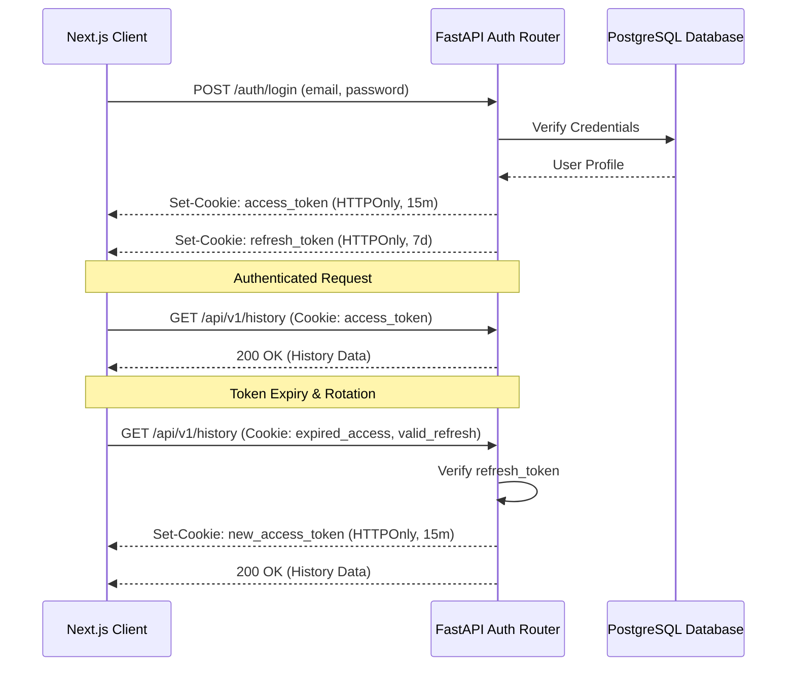

# ADR 0002: Authentication Strategy

## Status
Accepted

## Context
Merit AI requires a secure way to authenticate users from the Next.js frontend to the FastAPI backend without exposing sensitive tokens to Cross-Site Scripting (XSS) attacks.

## Decision
We will use **JWT (JSON Web Tokens) with HTTPOnly Cookies**.
1. **Access Tokens**: Short-lived JWTs (e.g., 15 minutes) stored exclusively in an `HttpOnly`, `Secure`, `SameSite=Strict` cookie named `access_token`. 
2. **Refresh Tokens**: Long-lived JWTs (e.g., 7 days) stored in an `HttpOnly`, `Secure` cookie named `refresh_token`.
3. **Cookie Behavior**: Since the cookies are HTTPOnly, the frontend cannot read them. The frontend will rely on a `/api/v1/auth/me` endpoint to fetch the current user's profile and infer authentication status. 
4. **Token Rotation**: When the `access_token` expires, the backend will automatically intercept the `refresh_token`, validate it, and issue a new `access_token` cookie via the response headers.

### Authentication Flow Diagram

## Consequences
- **Positive:** Immune to typical XSS attacks since JavaScript cannot access the cookies. Secure cross-origin requests (CORS) are strictly managed by `SameSite` policies.
- **Negative:** Requires strict CORS configurations and frontend proxying or aligned domains to allow credentials to be sent (`credentials: 'include'`). CSRF protections will be necessary if `SameSite` is not sufficient for legacy clients.
