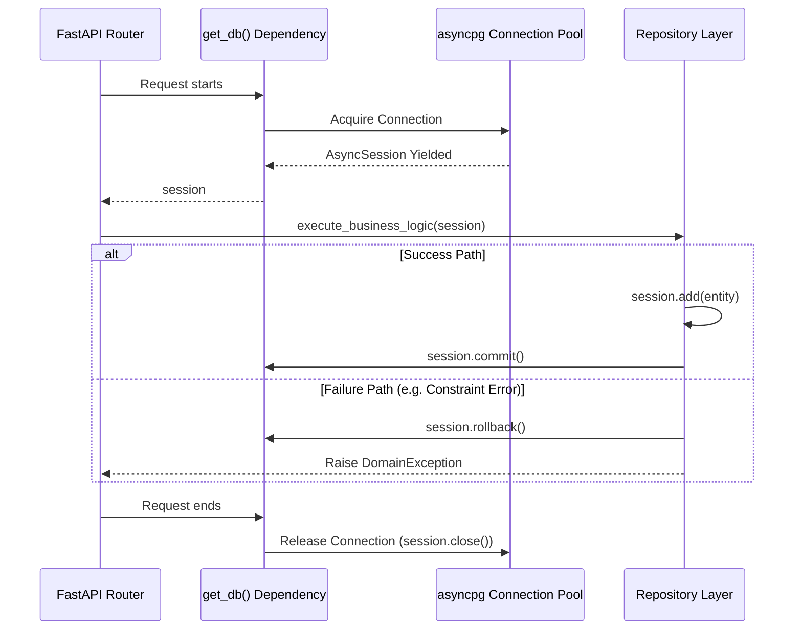

# ADR 0004: Database Lifecycle and Transactions

## Status
Accepted

## Context
Merit AI's backend uses FastAPI, meaning database connections and sessions must be carefully managed to prevent connection leaks, especially when orchestrating long-running parallel tasks (like ATS engine pipelines).

## Decision
1. **Connection Pooling**: We will use `asyncpg` combined with SQLAlchemy's `AsyncEngine`. The pool size and max overflow will be tuned via environment variables to match production load, avoiding exhaustion under spike traffic.
2. **Session Lifecycle**: 
   - A single `AsyncSession` is instantiated per HTTP request using FastAPI's Dependency Injection (`Depends(get_db)`). 
   - The session lives for the duration of the request and is automatically closed in the `finally` block of the dependency generator.
3. **Transaction Boundaries**:
   - By default, SQLAlchemy `async_sessionmaker` operates with `autocommit=False`. 
   - Read operations do not require explicit commits.
   - Write operations (e.g., creating a new User, saving an AnalysisReport) are wrapped in `try/except` blocks. If an exception occurs, the repository explicitly calls `await session.rollback()`.
   - Successful writes are concluded with a single `await session.commit()` right before returning the data.
4. **Data Consistency**: Service-level functions that span multiple repositories must pass the same session object to ensure they operate within a single transaction boundary.

### Database Session Lifecycle Diagram

## Consequences
- **Positive:** Guaranteed connection cleanup. Transaction rollbacks ensure database integrity if an external API (like LLM parsing) fails midway through a complex save operation.
- **Negative:** Requires rigorous discipline to ensure sessions are not shared across asyncio Tasks incorrectly, which could lead to concurrent transaction errors in SQLAlchemy.
