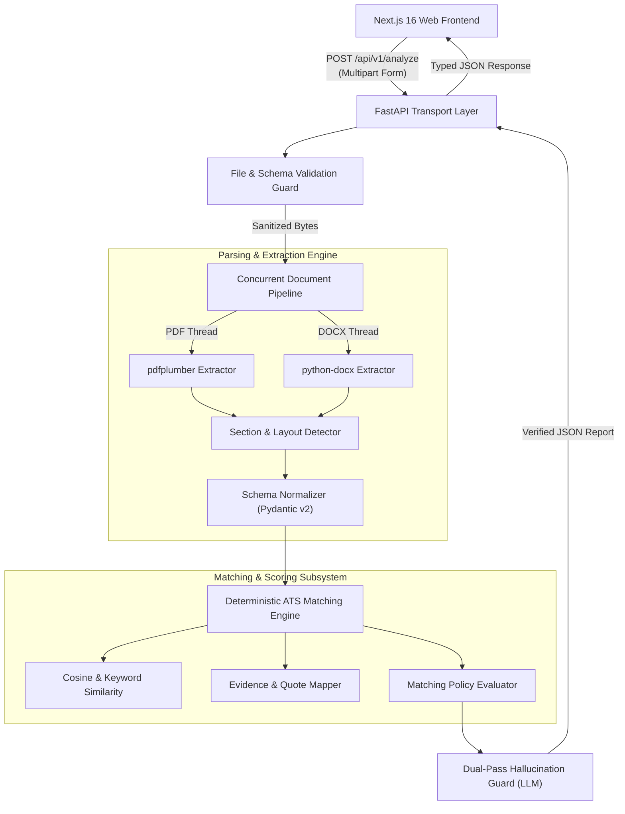
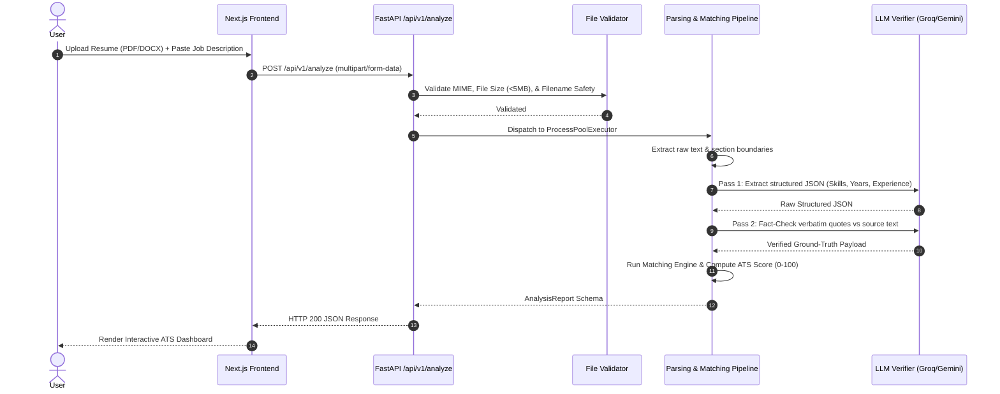

# 🏛️ Merit AI System Architecture

## Overview

Merit AI is designed around **Clean Architecture** principles to enforce strict boundary separation between API transport, input validation, parsing pipelines, deterministic semantic matching engines, and external LLM verification layers.



---

## Component Breakdown

### 1. Presentation Layer (`frontend/`)
- **Framework**: Next.js 16 (App Router), React 19, TypeScript
- **Styling**: Tailwind CSS v4, Framer Motion, Radix UI primitives
- **State & Transport**: Client-side state machine with typed API abstraction ([`api.ts`](file:///d:/Apps/Resume_Analyzer/frontend/src/lib/api.ts))

### 2. Transport & Controller Layer (`backend/app/api/`)
- **Framework**: FastAPI (Async ASGI)
- **Versioning**: Prefix-based route versioning (`/api/v1`)
- **Exception Handling**: Global exception interceptor (`app/exceptions/handlers.py`) returning uniform JSON payloads:
  ```json
  {
    "error": {
      "code": "INVALID_FILE_TYPE",
      "message": "File extension .exe is not permitted",
      "details": null
    }
  }
  ```

### 3. Parsing Subsystem (`backend/app/parsers/`)
- Isolated parsers for resumes (`app/parsers/resume/`) and job descriptions (`app/parsers/job_description/`)
- Multi-threaded text extraction offloaded to `ProcessPoolExecutor` via `asyncio.gather`
- Layout detection algorithm isolates Work Experience, Technical Skills, Education, and Projects

### 4. Matching & ATS Engine (`backend/app/matching/`)
- **Similarity Computation**: TF-IDF keyword overlap + semantic embedding vector scoring
- **Evidence Collector**: Extracts verbatim supporting text snippets from the resume for each required skill
- **Policy Matrix**: Configurable domain weights (Hard Skills: 40%, Experience Relevancy: 30%, Tooling: 20%, Education: 10%)

### 5. Dual-Pass Hallucination Guard (`backend/app/parsers/*/verifier.py`)
- Pass 1: Extraction & Structuring via LLM
- Pass 2: Fact-checking verifier cross-references LLM outputs against source document raw strings before score finalization

---

## Data Flow Diagram



---

## Further Reading
- [API Specification](API.md)
- [Matching Engine & Scoring Logic](MatchingEngine.md)
- [Hallucination Guard Mechanics](HallucinationGuard.md)
- [Security Specifications](Security.md)
