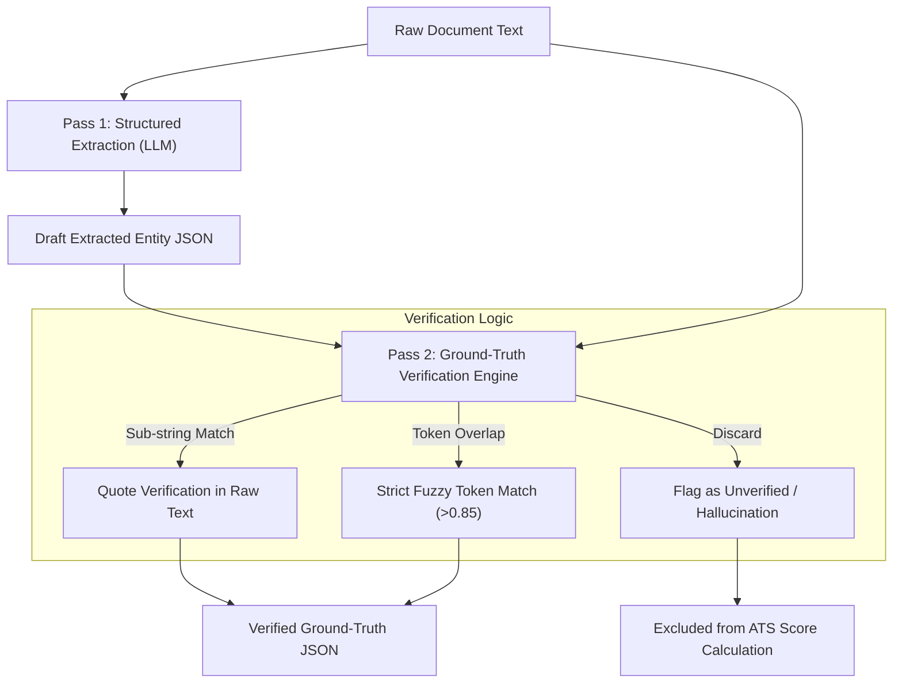

# 🛡️ Dual-Pass Hallucination Guard Architecture

## The Problem with LLMs in ATS Parsing

Large Language Models (LLMs) are prone to **hallucinations** — inventing skills, degrees, or experience that a candidate does not possess, or assuming experience based on job titles. 

In an ATS application, a single hallucinated skill renders the match score untrustworthy.

---

## Merit's Dual-Pass Defense Architecture

Merit AI eliminates hallucinations through a **Dual-Pass Verification Pipeline** (`app/parsers/resume/verifier.py` & `app/parsers/job_description/verifier.py`).

---

## Verification Protocol

1. **Pass 1 (Extraction)**: The LLM processes raw resume text and extracts candidate profile details into Pydantic v2 schemas.
2. **Pass 2 (Verification)**:
   - For every extracted skill, company, title, or degree, the verifier executes a string-matching search against the original raw text.
   - If the extracted entity cannot be located in the original raw document text (via exact string match or high-confidence fuzzy token match), the entity is **flagged as an unverified hallucination** and dropped.
3. **Deterministic Output Guarantee**: Only entities verified against source raw text are passed to the matching engine.
