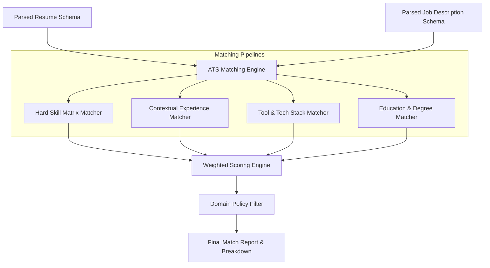

# ⚙️ Deterministic ATS Matching Engine

## Overview

Traditional Applicant Tracking Systems (ATS) rely heavily on naive exact keyword matching. Merit AI implements a **Hybrid Semantic & Deterministic Matching Engine** located in `app/matching/`. 

It combines exact keyword extraction, fuzzy string matching, semantic embedding similarity, and rule-based policy scoring to provide an accurate, explainable ATS match score (0–100).



---

## Scoring Formula & Weights

The overall ATS Match Score is a deterministic weighted sum of four domain scores:

$$\text{ATS Score} = (S_{\text{hard}} \times 0.40) + (S_{\text{experience}} \times 0.30) + (S_{\text{tooling}} \times 0.20) + (S_{\text{education}} \times 0.10)$$

Where:
- **$S_{\text{hard}}$ (Hard Skills - 40%)**: Coverage of core technical requirements specified in the job description.
- **$S_{\text{experience}}$ (Experience Relevancy - 30%)**: Similarity score between candidate work history bullet points and required responsibilities.
- **$S_{\text{tooling}}$ (Tools & Ecosystem - 20%)**: Match rate for specific libraries, frameworks, cloud providers, and databases.
- **$S_{\text{education}}$ (Education & Certifications - 10%)**: Degree requirement satisfaction (e.g., BS in Computer Science or equivalent).

---

## Skill Extraction & Evidence Isolation

For every matched skill, the matching engine extracts a **verbatim quote** from the resume to act as proof.

### Example Evidence Mapping
```json
{
  "skill": "PostgreSQL",
  "category": "Databases",
  "matched": true,
  "confidence_score": 0.96,
  "evidence_quote": "Designed and optimized PostgreSQL database schemas serving over 200k daily active users."
}
```

If a required skill cannot be backed by a quote from the resume text, it is classified as **Missing** regardless of LLM assertions, guaranteeing 100% explainability.
