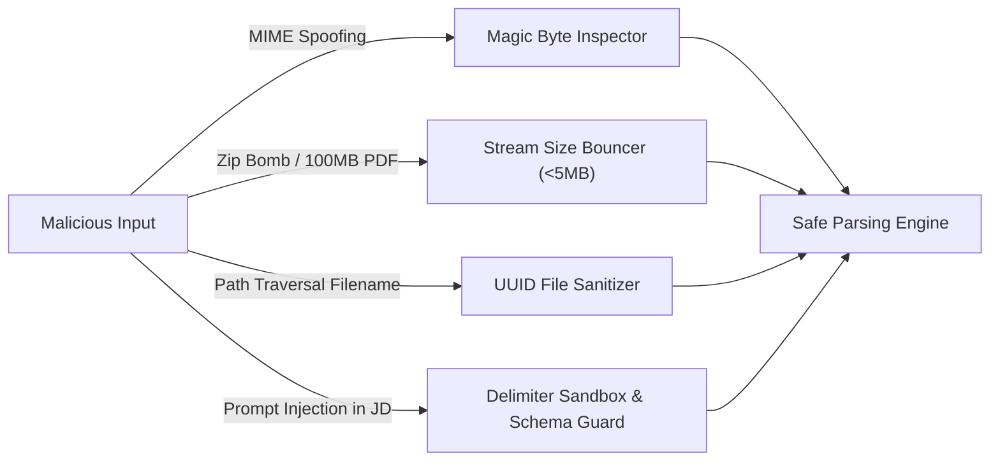

# 🛡️ Security & Reliability Specifications

## Core Security Principles

Merit AI handles potentially sensitive candidate documents. Security is built in at every architectural layer:

1. **Zero-Persistence Default**: Uploaded files are processed in-memory or in isolated temporary directories and purged immediately post-analysis.
2. **Strict MIME & Magic Byte Validation**: Filenames and client-declared Content-Types are never trusted.
3. **DoS & Resource Exhaustion Protection**: File size limits, timeout guards, and worker isolation prevent server crash scenarios.
4. **Prompt Injection & LLM Containment**: User input text is strictly sanitized and isolated within structured data schemas before being evaluated by LLM layers.

---

## Threat Model & Defenses

---

## Implemented Hardening Controls

### 1. File Upload Defense (`app/validators/file_validator.py`)
- **Magic Bytes Validation**: Verifies PDF header (`%PDF-`) and DOCX zip signature (`PK\x03\x04`).
- **Filename Sanitization**: Uses `uuid.uuid4().hex` to rename files prior to storage, preventing directory traversal (`../../etc/passwd`).
- **Size Boundary Enforcement**: Rejects files smaller than 100 bytes (empty/corrupted) or larger than 5 MB.

### 2. Event Loop Protection
- Parsing complex PDFs using `pdfplumber` is CPU-bound and blocking.
- Merit offloads all parsing workloads to a dedicated `ProcessPoolExecutor` utilizing `asyncio.gather`.
- Prevents main thread event loop starvation and keeps FastAPI responsive under concurrent load.

### 3. Red Team Security Test Suite (`tests/test_red_team.py`)
The codebase includes dedicated Red Team unit tests validating defenses against:
- Oversized payload attacks
- Executable binary disguised as `.pdf`
- Null byte injection in file names (`resume.pdf\x00.exe`)
- Malicious prompt injection payloads designed to override LLM extraction rules

---

## Compliance & Privacy
- **API Keys**: Stored exclusively via environment variables (`.env`). Never logged or returned in HTTP responses.
- **No Data Training**: User resumes are processed via enterprise API endpoints without data retention for model training.
